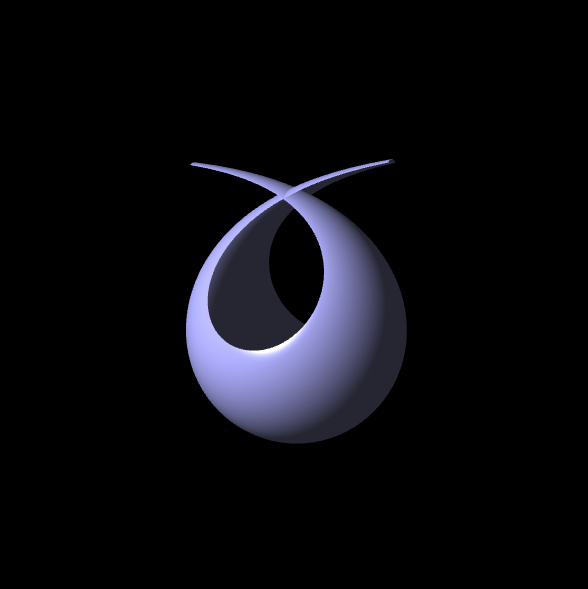
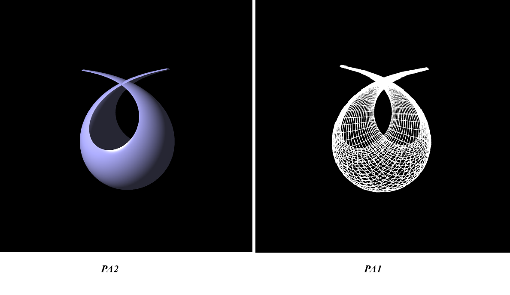
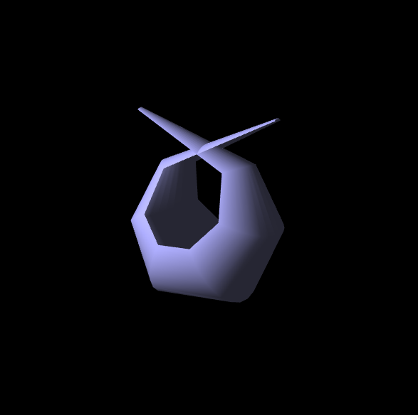
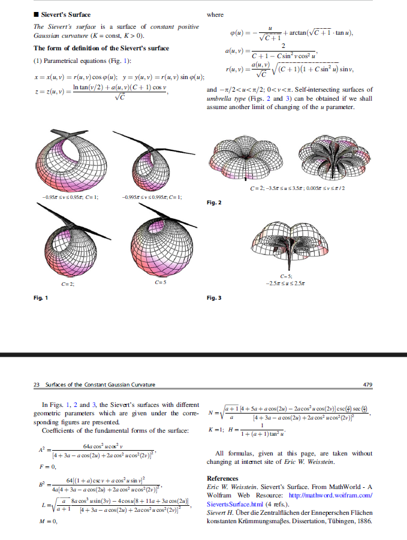

# VGGI – Practical Assignment №2 
### **Sievert's Surface (Variant 18)**  
**Author:** Andrii Khavkin  
**Group:** TR-52mp  
**Course:** Visualization of Graphical and Geometric Information  

---

## Overview

This project implements **Gouraud shading**, dynamic lighting, facet-average normals, and adjustable mesh resolution for the analytical **Sievert’s Surface (Variant 18)** using **WebGL 1.0**.

The work extends **PA1**, adding full shading and lighting pipeline functionality.


---

## Gallery

<div align="center">









</div>

---

## Assignment Requirements (PA2)

This project implements all requirements of Practical Assignment №2:

- Use PA1 as a starting point  
- Render filled **triangle mesh** instead of wireframe  
- Compute **vertex normals** using **Facet Average** method  
- Implement **Gouraud shading** (lighting in vertex shader)  
- Use **Ambient + Diffuse (Lambert) + Specular (Phong)** lighting components  
- Animate a **point light** moving around the surface  
- Provide two interactive sliders:
  - **U segments**
  - **V segments**
- Dynamically rebuild mesh on slider update  
- Render Sievert’s Surface (Variant 18)  
- Provide screenshots & video demonstration

---

## Sievert Surface – Variant 18

The parametric surface is defined by the following functions:

φ(u) = ...
r(u, v) = ...
a(u, v) = ...
z(u, v) = ...

*(These formulas come from the assignment PDF; see the attached reference below.)*

<div align="center">

</div>

---

## Project Structure

WebGL/<br>
│<br>
├── index.html # UI + canvas + sliders<br>
├── main.js # Rendering loop, matrices, light animation<br>
├── model.js # Mesh generation, normals, buffers<br>
├── shader.gpu # Vertex + fragment shaders<br>
│<br>
├── utils/<br>
│ └── m4.js # Matrix operations (MV, MVP, NormalMatrix)<br>
│<br>
└── screenshots/<br>
├── final_render.png<br>
├── wireframe_vs_filled.png<br>
├── normals_visualization.png<br>
└── pdf_reference.png<br>

---

## Implementation Details

### 🔹 6.1. Triangle Mesh Generation
- The parametric domain *(u, v)* is discretized into **U × V** segments.
- For each grid cell, two triangles are created.
- Index buffer stores triangle connectivity.

### 🔹 6.2. Vertex Normals – Facet Average
For each triangle:

facetNormal = normalize(cross(v1 - v0, v2 - v0))

This normal is added to the normals of all three vertices:

vertexNormal[v0] += facetNormal
vertexNormal[v1] += facetNormal
vertexNormal[v2] += facetNormal

Finally, all vertex normals are normalized.

### 🔹 6.3. Gouraud Shading (Lighting in Vertex Shader)

Vertex shader computes full lighting:

color = Ambient
+ Diffuse * max(dot(N, L), 0)
+ Specular * pow(max(dot(R, V), 0), shininess)

Fragment shader simply interpolates:

gl_FragColor = vColor;

### 🔹 6.4. Matrices

Used:

- **ModelViewMatrix**
- **NormalMatrix** — inverse transpose of MV's top-left 3×3
- **ModelViewProjectionMatrix**

These are passed to the vertex shader each frame.

### 🔹 6.5. Animated Point Light

Light moves along a circular trajectory around the surface:

light.x = R * cos(t)
light.y = height
light.z = R * sin(t)

This provides dynamic highlights and realistic shading.

---

## 🎚 Interactive Controls (Sliders)

Two sliders allow adjusting the surface resolution:

- **U segments**
- **V segments**

Whenever the user moves a slider:

surface.uSegments = newValue
surface.vSegments = newValue
surface.buildMesh()

The mesh is regenerated instantly and rendered with new density.

---

## Running the Project

### **Option 1 – Live Server (VS Code)**  
Right-click `index.html` → **Open with Live Server**

### **Option 2 – http-server**

```bash
npm install -g http-server
http-server
Then open:

http://localhost:8080
WebGL does not allow file:// — local HTTP server is required.

```
---

## Video Presentation (2 minutes)
A short video demonstrating:

mesh generation

sliders (U/V)

rotation with mouse

dynamic lighting

shading close-ups

Link: https://www.youtube.com/watch?v=vpb97juPtBk

---

## PA2 Checklist
- [x] Triangle mesh rendering
- [x] Facet average vertex normals
- [x] Gouraud shading
- [x] Animated point light
- [x] Ambient + Diffuse + Specular
- [x] U/V sliders
- [x] MVP + NormalMatrix
- [x] Screenshots included
- [x] Video included
- [x] Branch name: PA2

---

## Licensing

Educational project for KPI / VGGI course (2025).