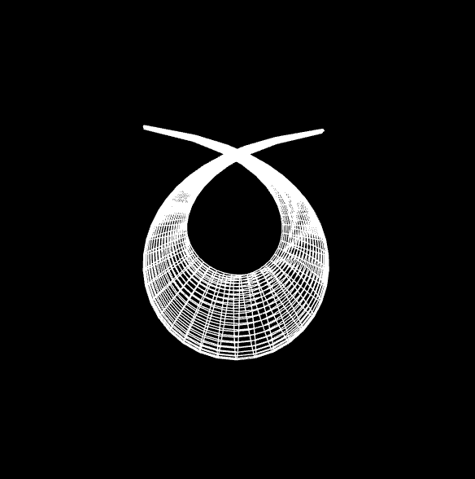
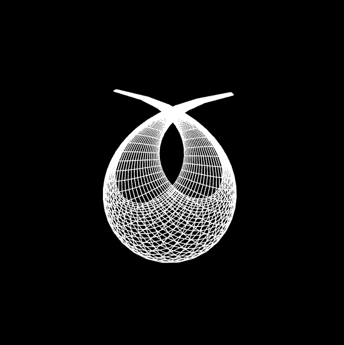

# VGGI – Practical Assignment №1  
### **Sievert's Surface (Variant 18)**  
**Author:** Andrii Khavkin  
**Group:** TR-52mp  
**Course:** Visualization of Graphical and Geometric Information  

---

## Overview

This project implements an analytical **Sievert’s Surface** using **WebGL**.  
The surface is rendered as a **wireframe model**, composed of **U-polylines** and **V-polylines**, as required by the assignment.

The model uses:
- parametric equations of Sievert’s surface (C = 1),
- WebGL shader pipeline,
- dynamic vertex buffer construction,
- a simple virtual trackball for rotation.

---

## Analytical Definition of Sievert’s Surface

The surface is defined parametrically as:

\[
\begin{aligned}
x &= r(u,v)\cos \varphi(u),\\
y &= r(u,v)\sin \varphi(u),\\
z &= \frac{\ln(\tan(v/2)) + a(u,v)(C+1)\cos v}{\sqrt{C}},
\end{aligned}
\]

where:

\[
\varphi(u) = -\frac{u}{\sqrt{C+1}} + \arctan(\sqrt{C+1}\tan(u)),
\]

\[
a(u,v) = \frac{2}{C+1 - C\sin^2(v)\cos^2(u)},
\]

\[
r(u,v) = \frac{a(u,v)}{\sqrt{C}}\sqrt{(C+1)(1+C\sin^2(u))}\sin(v).
\]

### Source reference  

---

## Project Structure

WebGL/
│
├── index.html # Main HTML interface
├── main.js # WebGL rendering and camera control
├── model.js # Model class: U/V lines, buffers, construction
├── shaders.js # Vertex & fragment shaders
├── utils/
│ └── m4.js # Matrix math library
└── screenshots/ # Screenshots for README

yaml
Копіювати код

---

## How the Wireframe is Constructed

### **1. U-Polylines**
For each fixed *u*, we sample many *v* values:

uLines[i] = [x0, y0, z0, x1, y1, z1, ...];

markdown
Копіювати код

### **2. V-Polylines**
For each fixed *v*, we sample many *u* values:

vLines[j] = [x0, y0, z0, x1, y1, z1, ...];

scss
Копіювати код

### **3. Line Segment Buffers**
All polylines are converted into WebGL-friendly line-segment lists:

[x1, y1, z1, x2, y2, z2] → one segment

markdown
Копіювати код

Two vertex buffers are created:
- `uBuffer` → all U-line segments  
- `vBuffer` → all V-line segments  

Rendering uses:

gl.drawArrays(gl.LINES, ...)

yaml
Копіювати код

---

## Running the Project

You can use **VS Code Live Server** or any static file server:

npx http-server

arduino
Копіювати код

Then open:

http://localhost:5500/WebGL/

yaml
Копіювати код

---

## Screenshots

### **Final Render (front view)**

### **Final Render (angled view)**

---

## 🎥 Video Explanation (for the assignment)

The accompanying 2-minute video explains:
- how equations were implemented,
- how U-polylines and V-polylines are generated,
- how vertex buffers are built,
- how the wireframe is rendered in WebGL.

---

## ✔️ Assignment Requirements Checklist

- [x] Implement Model class  
- [x] U-polylines and V-polylines data structure  
- [x] Parametric Sievert’s Surface (variant 18)  
- [x] GPU line buffers  
- [x] WebGL wireframe rendering  
- [x] Screenshot of the result  
- [x] 2-minute explanation video prepared  

link: https://www.youtube.com/watch?v=6Mi5_h0dbTQ
---

## 📄 Licensing

Educational project for KPI / VGGI course (2025).