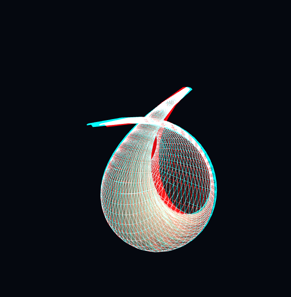

# MSVR – Practical Assignment №1  
### **WebGL Stereo Camera and Anaglyph Rendering – Sievert’s Surface (Variant 18)**

**Author:** Andrii Khavkin  
**Group:** TR-52mp  
**Course:** Methods of Synthesis of Virtual Reality  

---

## Overview

This project implements a WebGL-based stereo camera system for rendering an analytical 3D surface as a red-cyan anaglyph image.

The work is based on the analytical surface renderer developed in the previous discipline **“Visualization of Graphical and Geometric Information”**. The existing WebGL pipeline was extended with an off-axis stereo camera, two-pass rendering, color-channel masking, and wireframe rendering over filled polygons.

The application renders **Sievert’s Surface** as a triangle mesh with texture mapping, normal mapping, specular mapping, per-pixel lighting, and an animated point light source.

The main goal of the assignment is to demonstrate stereoscopic visualization using a WebGL stereo camera with adjustable parameters.

---

## Gallery

<div align="center">




</div>

---

## Assignment Requirements

The practical assignment requires implementing a stereo camera system in WebGL.

The application includes:

- rendering of an analytical 3D model;
- anaglyph stereo visualization using red-cyan color masks;
- negative parallax effect;
- wireframe rendering over filled polygons;
- interactive model rotation using the mouse;
- adjustable stereo camera parameters:
  - eye separation;
  - convergence;
  - field of view;
  - near clipping plane;
- preparation of the rendering pipeline for displaying a webcam stream in the zero-parallax plane.

---

## Stereo Camera Implementation

The stereo effect is produced by rendering the scene twice:

1. **Left eye pass**  
   The scene is rendered using the left-eye projection matrix and written only to the red channel.

2. **Right eye pass**  
   The scene is rendered using the right-eye projection matrix and written to the green and blue channels.

This forms a red-cyan anaglyph image that can be viewed with anaglyph stereo glasses.

The color masks are configured as follows:

```javascript
// Left eye
gl.colorMask(true, false, false, true);

// Right eye
gl.colorMask(false, true, true, true);
```

The depth buffer is cleared between the two passes to avoid incorrect depth rejection between left-eye and right-eye views.

---

## Stereo Camera Parameters

The stereo camera uses the following adjustable parameters:

| Parameter | Description |
|---|---|
| Eye separation | Distance between the virtual left and right cameras |
| Convergence | Distance to the zero-parallax plane |
| FOV | Vertical field of view angle |
| Near clip | Near clipping plane distance |

The projection matrices are calculated separately for the left and right eye using an asymmetric frustum.

The left and right camera views are additionally shifted along the X axis according to the eye separation value.

---

## Negative Parallax

The model is positioned relative to the convergence plane so that it can produce a negative parallax effect. In this mode, parts of the model appear to be located in front of the screen plane when viewed through red-cyan anaglyph glasses.

This effect is controlled by the relationship between:

- model position;
- convergence distance;
- eye separation;
- field of view.

The user can adjust these parameters interactively using the sliders on the page.

---

## Analytical Surface

The rendered object is **Sievert’s Surface**, generated analytically from its parametric definition.

The surface is built as a regular parameter grid over `(u, v)`, where each grid point is converted into a 3D point by the function:

```javascript
surfaceFunc(u, v)
```

The resulting vertices are connected into indexed triangles. The model also stores vertex normals, texture coordinates, tangent vectors, and index buffers for both filled rendering and wireframe rendering.

---

## Rendering Pipeline

The surface uses the rendering pipeline inherited from the previous WebGL work:

- analytical mesh generation;
- indexed triangle rendering;
- vertex normals;
- tangent vectors;
- TBN basis;
- diffuse texture;
- specular texture;
- normal map;
- per-pixel Phong lighting;
- animated point light.

The stereo camera logic is added on top of this pipeline without removing the previous shading functionality.

---

## Wireframe over Filled Polygons

The model is rendered in two layers:

1. **Filled surface**  
   The triangle mesh is rendered with textures, normal mapping, and lighting.

2. **Wireframe overlay**  
   A separate line index buffer is used to render the polygonal structure over the filled model.

The wireframe is rendered through a separate lightweight shader that outputs a constant color. This makes the mesh structure visible independently of the surface texture.

---

## Project Structure

```text
WebGL/
│
├── index.html              # HTML page, canvas, UI controls, assignment description
├── main.js                 # WebGL initialization, stereo camera, draw loop, UI logic
├── model.js                # Analytical surface mesh, normals, tangents, wireframe indices
├── shader.gpu              # Main shader and wireframe shader sources
├── TextureHandler.js       # Helper for loading 2D textures
│
├── Utils/
│   ├── m4.js               # Matrix utilities
│   └── trackball-rotator.js # Mouse-based model rotation
│
├── textures/
│   ├── diffuse.jpg         # Diffuse texture
│   ├── specular.jpg        # Specular texture
│   └── normal.jpg          # Tangent-space normal map
│
└── screenshots/
    ├── final_render.png
    └── stereo_wireframe.png
```

---

## Interactive Controls

### Mouse

| Action | Description |
|---|---|
| Mouse drag | Rotate the model around its center |

### Keyboard

| Key | Action |
|---|---|
| T | Toggle stereo anaglyph / mono rendering |

### Sliders

| Control | Description |
|---|---|
| U segments | Surface resolution along parameter `u` |
| V segments | Surface resolution along parameter `v` |
| Eye separation | Distance between the virtual cameras |
| Convergence | Zero-parallax distance |
| FOV | Vertical field of view angle |
| Near clip | Near clipping plane distance |

---

## Running the Project

### Option 1 – VS Code Live Server

1. Open the project folder in VS Code.
2. Right-click `index.html`.
3. Select **Open with Live Server**.
4. The page will open in the browser.

### Option 2 – http-server

Install `http-server`:

```bash
npm install -g http-server
```

Run the server from the project directory:

```bash
http-server
```

Then open the local address shown in the terminal, for example:

```text
http://localhost:8080
```

WebGL content should be served through HTTP. Direct `file://` access may cause browser security restrictions, especially when loading textures or webcam input.

---

Video Explanation (for the assignment)

The accompanying 2-minute video explains:

- how the analytical Sievert’s Surface is generated from parametric equations,
- how the triangle mesh and wireframe index buffers are constructed,
- how the stereo camera is implemented using asymmetric frustums,
- how left-eye and right-eye rendering passes are combined into a red-cyan anaglyph image,
- how color masking and depth-buffer control are used during stereo rendering,
- how wireframe rendering over filled polygons is implemented,
- how the stereo camera parameters are adjusted interactively,
- and how the model is rotated using the trackball mouse controller.

link: https://youtu.be/Dl4njZ3JzWg

---


## Implementation Checklist

- [x] WebGL scene initialization
- [x] Analytical Sievert’s Surface generation
- [x] Indexed triangle mesh
- [x] Normals and tangent vectors
- [x] Diffuse, normal, and specular maps
- [x] Per-pixel lighting
- [x] Animated point light
- [x] Trackball mouse rotation
- [x] Stereo camera class
- [x] Left-eye and right-eye asymmetric frustums
- [x] Red-cyan anaglyph rendering
- [x] Depth-buffer reset between stereo passes
- [x] Adjustable eye separation
- [x] Adjustable convergence
- [x] Adjustable FOV
- [x] Adjustable near clipping plane
- [x] Wireframe over filled polygons
- [x] Mono/stereo toggle

---

## Notes

The project reuses the analytical surface and shading architecture from the previous WebGL assignment, but the main focus of this laboratory work is the implementation of stereoscopic rendering.

The rendering pipeline is organized so that additional VR-related features, such as a webcam stream in the zero-parallax plane, can be integrated into the scene without restructuring the main surface rendering code.

---

## Licensing

Educational project for KPI / Methods of Synthesis of Virtual Reality course.
