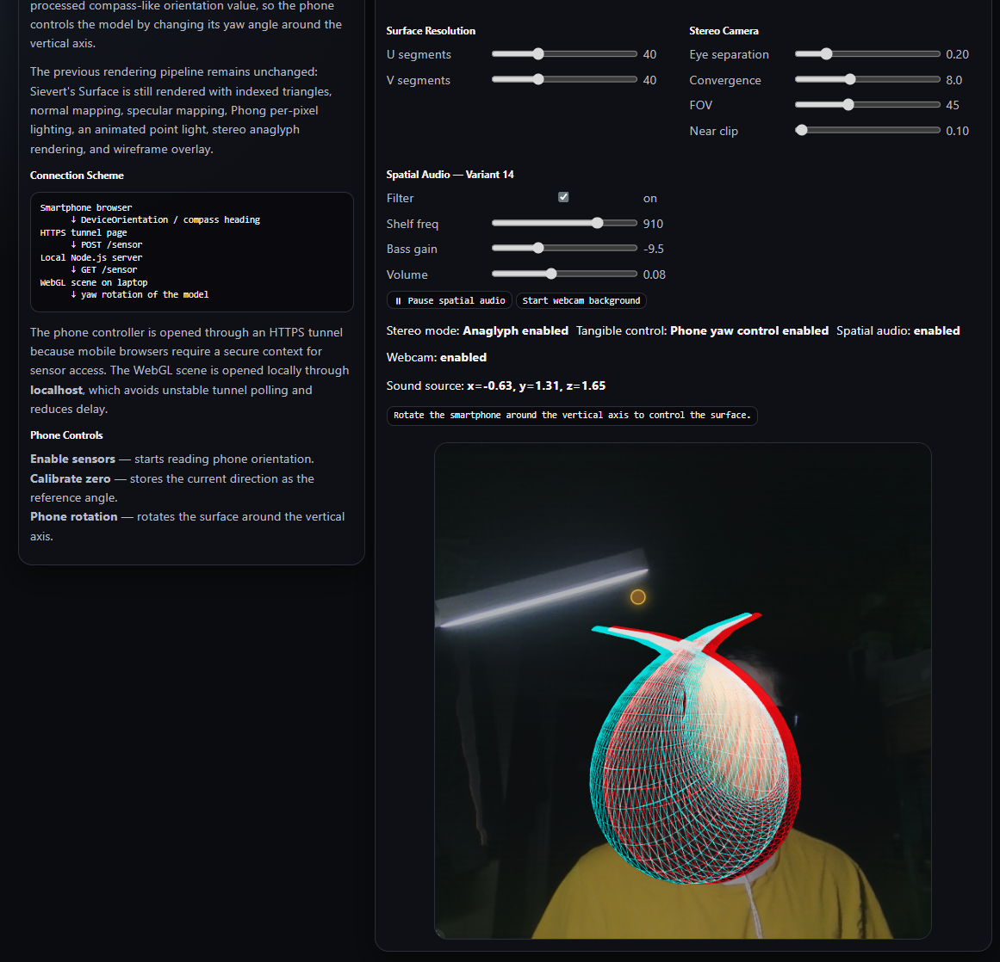

# MSVR – Calculation Work / Practical Assignment №3  
### **Spatial Audio for WebGL Scene – Low-frequency Shelf Filter (Variant 14)**

**Author:** Andrii Khavkin  
**Group:** TR-52mp  
**Course:** Methods of Synthesis of Virtual Reality  

---

## Overview

This project extends the existing WebGL virtual scene with spatial audio. The work continues the previous MSVR practical assignments and keeps the same rendering pipeline: analytical parametric surface generation, indexed triangle mesh, normal mapping, specular mapping, per-pixel Phong lighting, animated light source, stereo anaglyph rendering, wireframe overlay, mouse trackball rotation, and optional tangible phone-based yaw control.

The main goal of this calculation work is to reproduce an audio track in `mp3` or `ogg` format and allow the user to control the spatial position of the sound source. The sound source is represented by a visible marker over the WebGL scene. Dragging the mouse changes the source position around the object, while the Web Audio API updates the corresponding 3D panner coordinates.

According to **Variant 14**, the project implements a **low-frequency shelf filter**. The audio signal is passed through a `BiquadFilterNode` with the `lowshelf` type. This filter increases or decreases the low-frequency part of the selected music track. The filter frequency and gain are controlled through the user interface.

Additionally, a live **webcam stream** is used as a visual background behind the rendered WebGL object. This creates a mixed-reality style scene where the analytical surface is displayed over real camera input.

---

## Gallery

<div align="center">



</div>

> The screenshot shows the implemented calculation work: WebGL scene with red-cyan stereo rendering, wireframe overlay, webcam background, spatial audio controls, low-shelf filter parameters, and the visible sound source marker.

---

## Assignment Requirements

The calculation work requires implementing spatial audio in a WebGL-based virtual scene.

The implemented application includes:

- reproduction of an external music file in `mp3` format;
- spatial positioning of the audio source using Web Audio API;
- user-controlled sound source movement;
- visible marker showing the approximate source position on the scene;
- low-frequency shelf filter for Variant 14;
- interactive control of shelf frequency and bass gain;
- webcam stream used as a live background for the WebGL object;
- preservation of the previous stereo anaglyph rendering pipeline;
- preservation of the analytical Sievert’s Surface model and wireframe overlay.

---

## Spatial Audio Concept

The spatial audio subsystem is implemented as a separate layer over the existing rendering loop. It does not replace or rewrite the WebGL rendering pipeline. The main scene continues to be rendered by `main.js`, while the audio graph is implemented in `spatialAudio.js`.

The user controls the source position by dragging the mouse over the WebGL canvas. The horizontal mouse movement changes the azimuth angle, while the vertical mouse movement changes the elevation. These angles are converted into 3D coordinates on an orbit around the virtual object.

The calculated source position is applied to a `PannerNode`. At the same time, the yellow marker on the canvas is updated, and the current coordinates are displayed in the interface.

---

## Audio Processing Pipeline

The project uses the following Web Audio API signal chain:

```text
HTMLAudioElement (.mp3 / .ogg)
        ↓
MediaElementAudioSourceNode
        ↓
BiquadFilterNode(type = "lowshelf")
        ↓
PannerNode(HRTF spatialization)
        ↓
GainNode
        ↓
AudioContext destination
```

The audio source is loaded from the local project directory, for example:

```text
audio/song.mp3
```

The original oscillator-based test sound was replaced with a real audio file because the assignment requires reproducing a favorite song or audio track in `mp3`/`ogg` format.

---

## Variant 14 – Low-frequency Shelf Filter

The selected variant requires a shelf filter for low frequencies. In the implementation, this is done using:

```javascript
filter = audioContext.createBiquadFilter();
filter.type = "lowshelf";
```

The filter has two main interactive parameters:

| Parameter | Description |
|---|---|
| Shelf frequency | Defines the boundary frequency of the low-frequency range |
| Bass gain | Boosts or attenuates low frequencies in decibels |

Positive gain values increase the bass part of the track, while negative values suppress low frequencies. This makes the effect clearly noticeable when using a song with a strong bass component.

---

## Webcam Background

The application also includes webcam video as a live background behind the WebGL object. The webcam stream is obtained through:

```javascript
navigator.mediaDevices.getUserMedia({
    video: true,
    audio: false
});
```

The video is displayed as an HTML `<video>` element inside the same canvas wrapper. The WebGL canvas is rendered above it with a transparent background. This allows the analytical surface to appear over the live camera image.

The webcam background is started manually using the **Start webcam background** button because browsers require user permission before accessing the camera.

---

## Rendering Pipeline

The spatial audio layer was added without removing the previous rendering functionality. The preserved graphics pipeline includes:

- analytical Sievert’s Surface generation;
- regular UV grid;
- indexed triangle mesh;
- vertex normals;
- tangent vectors;
- texture coordinates;
- Gram–Schmidt based TBN basis;
- diffuse, specular, and normal maps;
- per-pixel Phong lighting;
- animated point light;
- trackball mouse rotation;
- stereo camera rendering;
- red-cyan anaglyph output;
- wireframe overlay over filled polygons;
- optional phone-based yaw control from the previous assignment.

The spatial audio source is updated once per animation frame. Its position is independent from the left-eye and right-eye stereo passes, so it does not interfere with the anaglyph rendering logic.

---

## Project Structure

```text
WebGL/
│
├── index.html               # Main page, UI controls, canvas, webcam video layer
├── main.js                  # WebGL initialization, render loop, stereo camera, UI logic
├── spatialAudio.js          # Web Audio API graph, low-shelf filter, panner, mp3 playback
├── server.js                # Local Node.js server, static files, audio MIME types
├── model.js                 # Analytical surface mesh, normals, tangents, wireframe indices
├── shader.gpu               # Main shader and wireframe shader sources
├── TextureHandler.js        # Texture loading helper
├── phone.html               # Smartphone controller from previous assignment
│
├── audio/
│   └── song.mp3             # Music file used as the spatial audio source
│
├── textures/
│   ├── diffuse.jpg          # Diffuse texture
│   ├── specular.jpg         # Specular texture
│   └── normal.jpg           # Tangent-space normal map
│
├── screenshots/
│   └── MSVR_CGW.png         # Screenshot of the final result
│
└── Utils/
    ├── m4.js                # Matrix utilities
    └── trackball-rotator.js # Mouse-based model rotation
```

---

## Running the Project

Install dependencies once:

```bash
npm install ws
```

Place the selected music file into the `audio` directory:

```text
audio/song.mp3
```

Run the local server:

```bash
node server.js
```

Open the project in the browser:

```text
http://localhost:8080/
```

Then:

1. Press **Start webcam background** to enable the live camera background.
2. Press **Play spatial audio** to start the music track.
3. Drag the mouse over the WebGL canvas to move the sound source.
4. Change **Shelf freq** and **Bass gain** to demonstrate the low-frequency shelf filter.
5. Use the **Filter** checkbox to compare filtered and unfiltered playback.

---

## Interactive Controls

### Spatial Audio

| Control | Description |
|---|---|
| Play / Pause spatial audio | Starts or pauses playback of the local audio track |
| Mouse drag on canvas | Changes the spatial position of the sound source |
| Yellow marker | Shows the approximate source position on the screen |
| Filter checkbox | Enables or disables the low-shelf filter |
| Shelf freq | Changes the low-frequency shelf boundary |
| Bass gain | Boosts or attenuates low frequencies |
| Volume | Controls output volume |

### Webcam

| Control | Description |
|---|---|
| Start webcam background | Requests camera access and displays webcam video behind the WebGL canvas |

### WebGL Scene

| Control | Description |
|---|---|
| Mouse drag | Trackball rotation of the analytical surface |
| U segments | Surface resolution along parameter `u` |
| V segments | Surface resolution along parameter `v` |
| Eye separation | Distance between the virtual stereo cameras |
| Convergence | Zero-parallax distance |
| FOV | Vertical field of view |
| Near clip | Near clipping plane distance |
| T | Toggle stereo anaglyph / mono rendering |
| M | Toggle phone-based yaw control from the previous assignment |

---

## Implementation Checklist

- [x] Reused the existing WebGL project architecture
- [x] Preserved Sievert’s Surface analytical mesh
- [x] Preserved indexed triangle rendering
- [x] Preserved normal, tangent, texture coordinate, and TBN data
- [x] Preserved diffuse, specular, and normal mapping
- [x] Preserved per-pixel Phong lighting
- [x] Preserved animated point light
- [x] Preserved red-cyan anaglyph stereo rendering
- [x] Preserved wireframe overlay over filled polygons
- [x] Added `spatialAudio.js` as a separate Web Audio API module
- [x] Replaced oscillator test sound with local `mp3` playback
- [x] Added `MediaElementAudioSourceNode` for music file playback
- [x] Added `BiquadFilterNode` with `lowshelf` type for Variant 14
- [x] Added interactive shelf frequency control
- [x] Added interactive bass gain control
- [x] Added `PannerNode` for spatial sound positioning
- [x] Added visible sound source marker
- [x] Added mouse-based control of sound source azimuth and elevation
- [x] Added current sound source coordinates to the interface
- [x] Added webcam video background behind the WebGL object
- [x] Added MIME types for audio files in the local server
- [x] Verified playback, filter control, source movement, and webcam background

---

## Video Explanation Checklist

The accompanying video should demonstrate:

- launching the local Node.js server with `node server.js`;
- opening the WebGL application through `http://localhost:8080/`;
- the final WebGL scene with Sievert’s Surface and wireframe overlay;
- stereo red-cyan anaglyph rendering;
- webcam stream used as the background behind the virtual object;
- starting spatial audio playback with the **Play spatial audio** button;
- playback of the local `mp3` music file;
- moving the sound source by dragging the mouse over the canvas;
- movement of the yellow source marker;
- changing the source coordinates displayed in the UI;
- enabling and disabling the low-frequency shelf filter;
- changing **Shelf freq** and explaining that it sets the boundary of the low-frequency range;
- changing **Bass gain** and explaining that positive values boost bass while negative values attenuate bass;
- short explanation of the audio graph: audio file → low-shelf filter → spatial panner → gain → output;
- short explanation that Variant 14 is implemented through `BiquadFilterNode` with `type = "lowshelf"`.

Recommended video duration: **2–3 minutes**.

---

## Notes

The spatial audio component is implemented as an additional module and does not replace the previous WebGL rendering pipeline. This keeps the project modular and allows the earlier stereo and tangible interface features to remain available.


The webcam background is started only after user interaction, because browser security policies require explicit permission for camera access. The same applies to audio playback: the `AudioContext` starts only after pressing the play button.

---

## Licensing

Educational project for KPI / Methods of Synthesis of Virtual Reality course.
