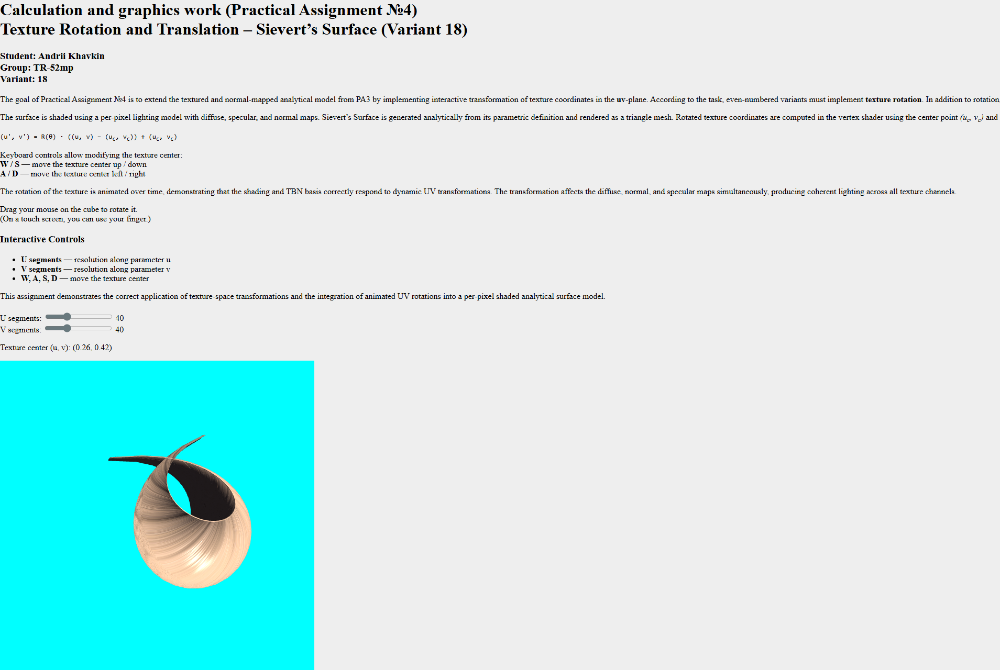
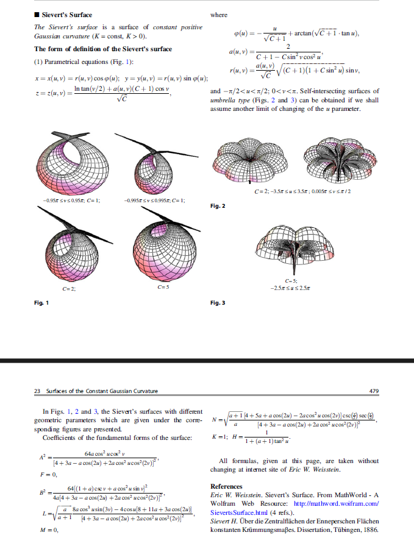

# VGGI – CONTROL TASK (Practical Assignment №4) 
###  **Texture Mapping and Normal Mapping – Sievert’s Surface (Variant 18)**    
**Author:** Andrii Khavkin  
**Group:** TR-52mp  
**Course:** Visualization of Graphical and Geometric Information  

---
## Overview

This project extends the analytical model of Sievert’s Surface from PA3 by implementing  
**interactive texture-coordinate transformation** in the UV plane.  
According to the specification for even-numbered variants, the required feature is:

### ✔ **Texture Rotation (even variants)**  
Additionally, the **texture center** can be moved interactively using keyboard input.  

The model is shaded using a full **per-pixel PBR-style pipeline**, including:

- diffuse (albedo) map  
- normal map  
- specular map  
- dynamically animated point light  
- TBN basis constructed using Gram–Schmidt (normal priority, Variant 18 rule)

Sievert’s Surface is generated analytically and rendered as a triangle mesh.

---

## Gallery

---

## Assignment Requirements (PA4)

- extend the PA3 model (texture + normal + specular mapping)
- implement interactive **UV transformation**
- even variants → **rotate the texture around arbitrary UV center**
- allow texture center movement using keyboard (`W`, `A`, `S`, `D`)
- perform rotation entirely in the shader
- update TBN-based shading accordingly
- render the analytical Sievert Surface as a triangle mesh

---

## Sievert Surface – Variant 18

The analytic surface is defined by:

- \( \varphi(u) \)  
- \( a(u, v) \)  
- \( r(u, v) \)  
- \( z(u, v) \)

The project uses these equations exactly as given in the original Sievert’s Surface definition.  

In code, the parametrization is implemented in the `surfaceFunc(u, v)` function, which returns a 3D point \((x, y, z)\) for given parameters \((u, v)\) and applies a global scale to fit the surface into the camera view.   

---

## 📐 Mathematical Background

Texture rotation around a point `(u_c , v_c)` is computed as:

(u', v') = R(θ) · ((u, v) – (u_c, v_c)) + (u_c, v_c)

Where the rotation matrix is:

R(θ) = | cosθ -sinθ | *| sinθ cosθ |

This transformation is performed in the **vertex shader**, prior to normal mapping.

---

## Project Structure

WebGL/ 
│ 
├── index.html           # HTML page, canvas, UI text, U/V sliders 
├── main.js              # WebGL init, shaders, matrices, light animation, draw loop 
├── model.js             # Sievert’s Surface mesh, normals, tangents, index buffers 
├── shader.gpu           # Vertex + fragment shaders (TBN + normal mapping) 
├── TextureHandler.js    # Helper for loading 2D textures with a blue fallback pixel 
│ 
├── Utils/ 
│   ├── m4.js            # Matrix utilities (MV, MVP, inverse/transpose) 
│   └── trackball-rotator.js # Mouse-based virtual trackball for view rotation 
│ 
├── textures/ 
│   ├── diffuse.jpg      # Diffuse (albedo) sand texture 
│   ├── specular.jpg     # Specular/gloss map 
│   └── normal.jpg       # RGB tangent-space normal map 
│ 
└── screenshots/ 
    ├── final_render_CT.png 
    └── pdf_reference.png 

TextureHandler.js initializes each texture as a 1×1 blue pixel and then asynchronously replaces it with the loaded image once it is available, forcing a redraw.

---

## 🔧 Implementation Details

### **1. UV Generation**
Each vertex stores parameter-space coordinates `(u, v)` generated analytically during mesh construction.

### **2. TBN Construction**
- Tangent `T`, bitangent `B`, and normal `N` are computed per vertex.
- Gram–Schmidt orthogonalization is applied with **normal priority** (Variant 18).
- The resulting TBN basis transforms normal-map vectors from tangent space to world space.

### **3. Texture Rotation**
In the vertex shader:

`` glsl
vec2 centered = texCoord - uTexCenter;
float c = cos(uTexAngle);
float s = sin(uTexAngle);

vec2 rotated = vec2(
    c*centered.x - s*centered.y,
    s*centered.x + c*centered.y
);

vTexCoord = rotated + uTexCenter; ``

### **4. Per-Pixel Shading**

The fragment shader applies:

 - sampled diffuse color
 - sampled specular intensity
 - sampled normal perturbation via TBN
 - ambient + diffuse + specular (Phong) lighting
 - dynamic animated point light

### Interactive Controls
Keyboard
Key	Action
W	move texture center upward
S	move texture center downward
A	move center left
D	move center right

### Sliders
Control	Description
U segments	mesh resolution in u
V segments	mesh resolution in v

The current texture center is displayed on the page:

Texture center (u, v): (0.50, 0.50)

---

## Running the Project

Option 1 – VS Code Live Server

Open the folder in VS Code.

Right-click index.html → Open with Live Server.

The page will open in the browser (typically at http://127.0.0.1:5500/...).

Option 2 – http-server
npm install -g http-server
http-server

Then open in your browser:

http://localhost:8080

WebGL content must be served via HTTP; direct file:// access is not allowed due to browser security restrictions.

---

## Video Presentation

The video (1.5–2 minutes) should demonstrate:

analytic Sievert’s Surface (Variant 18),

textured model with normal mapping,

dynamic point light moving around the surface,

effect of U/V resolution sliders,

close-ups showing sand-like relief and specular highlights.

Video link: https://youtu.be/e4_h7TrfRvM

---

## CT(PA3) Checklist

 - [x] Texture-space rotation

 - [x] Center translation via keyboard

 - [x] Per-pixel shading

 - [x] Normal + specular + diffuse maps

 - [x] Analytical Sievert Surface

 - [x] TBN with Gram–Schmidt (normal priority)

 - [x] Animated point light

 - [x] UV transformation in vertex shader

 - [x] Screenshots added

---

## Licensing

Educational project for KPI / VGGI course (2025).