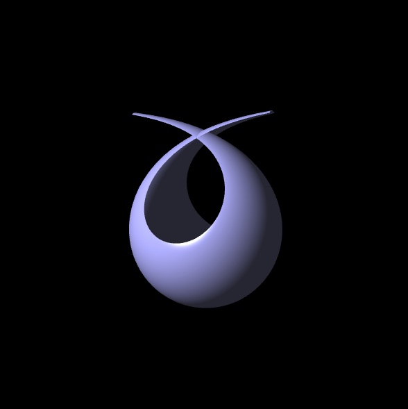
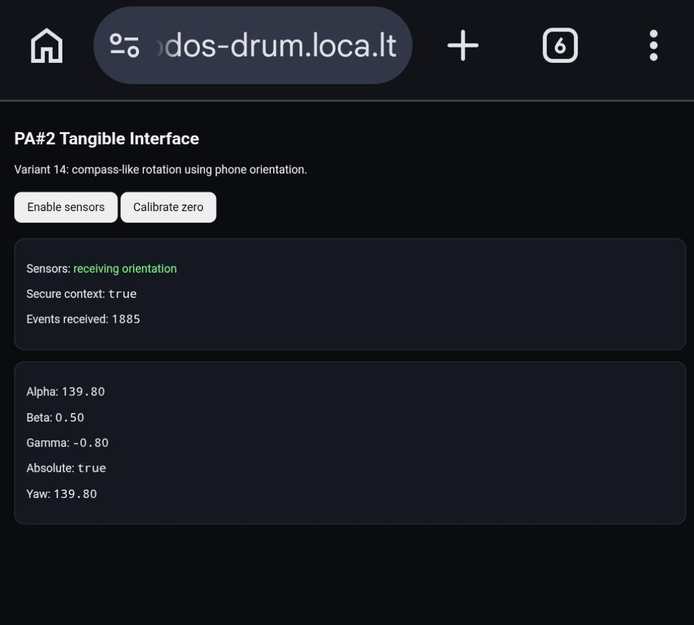

# MSVR – Practical Assignment №2  
### **Tangible Interface for WebGL Scene Control – Smartphone Compass Controller (Variant 14)**

**Author:** Andrii Khavkin  
**Group:** TR-52mp  
**Course:** Methods of Synthesis of Virtual Reality  

---

## Overview

This project extends the previous WebGL stereo rendering application with a tangible interface. The rendered analytical surface can now be controlled using a smartphone as a physical input device.

The work is based on the WebGL project developed for **Practical Assignment №1**, where a stereo camera and red-cyan anaglyph rendering were implemented. In this assignment, the existing rendering pipeline is preserved and extended with external sensor-based control.

According to **Variant 14**, the tangible input is based on a hardware magnetometer. In the implemented web-based version, the smartphone browser provides the processed compass-like orientation value through device orientation events. This value is used to rotate the model around the vertical axis, producing compass-like yaw control of the WebGL scene.

The rendered object remains **Sievert’s Surface**, generated as an analytical parametric mesh with indexed triangles, vertex normals, tangent vectors, texture coordinates, TBN basis, diffuse texture, specular map, normal map, per-pixel Phong lighting, animated point light, and wireframe overlay.

---

## Gallery

<div align="center">





</div>

> The second screenshot shows the smartphone controller page. The page receives orientation events, displays alpha/beta/gamma values, confirms secure context mode, and sends the current yaw angle to the local WebGL server.

---

## Assignment Requirements

The practical assignment requires implementing a tangible interface for controlling a virtual scene.

The application includes:

- use of a smartphone as a physical input device;
- compass-like rotation based on phone orientation;
- sensor access through a secure mobile browser context;
- local server communication between the phone and the WebGL scene;
- integration with the existing stereo WebGL renderer;
- preservation of red-cyan anaglyph rendering;
- preservation of wireframe rendering over filled polygons;
- interactive model rotation using both mouse and phone input.

---

## Tangible Interface Concept

The smartphone acts as an external physical controller. When the user rotates the phone around the vertical axis, the corresponding yaw angle is sent to the WebGL application and applied to the model transformation matrix.

The control principle is similar to a compass: only horizontal orientation is used. This matches the assignment variant, where a magnetometer-based input provides a single direction vector suitable for compass-like rotation rather than full 3D orientation tracking.

The phone controller is implemented as a separate HTML page. It reads orientation data from the mobile browser and sends the processed yaw angle to the local server. The WebGL page periodically reads the latest available sensor state and applies it during rendering.

---

## Communication Scheme

```text
Smartphone browser
      ↓ DeviceOrientation / compass heading
HTTPS tunnel page
      ↓ POST /sensor
Local Node.js server
      ↓ GET /sensor
WebGL scene on laptop
      ↓ yaw rotation of the model
```

The smartphone controller is opened through an HTTPS tunnel because mobile browsers require a secure context for access to orientation sensors. The WebGL scene itself is opened locally through `localhost`, which avoids unstable polling through the tunnel and improves responsiveness.

Recommended setup:

```text
Laptop WebGL page:
http://localhost:8080/

Phone controller page:
https://your-tunnel.loca.lt/phone.html
```

---

## Sensor Processing

The phone page listens to absolute device orientation events and extracts the `alpha` value, which corresponds to compass-like rotation around the vertical axis.

The current phone orientation is converted into a relative yaw angle using calibration. The calibration button stores the current phone direction as zero. After calibration, all further rotations are interpreted relative to this reference direction.

The yaw value is sent to the local Node.js server using a `POST /sensor` request. The WebGL application reads the most recent value through `GET /sensor` and applies it to the scene.

To improve visual stability, the WebGL side applies angle normalization and smoothing. This reduces abrupt jumps caused by compass noise and by transitions around the `180° / -180°` boundary.

---

## Rendering Pipeline

The tangible interface is added as an input layer above the existing rendering system. The original WebGL pipeline remains active:

- analytical Sievert’s Surface generation;
- regular UV grid;
- indexed triangle mesh;
- vertex normals;
- tangent vectors;
- Gram–Schmidt based TBN basis;
- diffuse texture mapping;
- specular mapping;
- tangent-space normal mapping;
- per-pixel Phong lighting;
- animated point light source;
- trackball mouse rotation;
- stereo camera rendering;
- red-cyan anaglyph output;
- wireframe overlay over filled polygons.

The phone yaw rotation is applied to the base view transformation before stereo left-eye and right-eye rendering. This makes the tangible control compatible with both mono and stereo modes.

---

## Stereo Rendering

The stereo rendering pipeline from the previous assignment is preserved.

The scene is rendered twice:

1. **Left eye pass**  
   The scene is rendered with the left-eye projection matrix and written only to the red channel.

2. **Right eye pass**  
   The scene is rendered with the right-eye projection matrix and written to the green and blue channels.

The color masks are configured as follows:

```javascript
// Left eye
gl.colorMask(true, false, false, true);

// Right eye
gl.colorMask(false, true, true, true);
```

The depth buffer is cleared between the two passes to avoid incorrect depth rejection between the left-eye and right-eye images.

---

## Project Structure

```text
WebGL/
│
├── index.html               # Main WebGL page, canvas, UI controls, assignment description
├── phone.html               # Smartphone controller page
├── server.js                # Local Node.js server, static files, /sensor API
├── main.js                  # WebGL initialization, stereo rendering, phone polling, draw loop
├── model.js                 # Analytical surface mesh, normals, tangents, wireframe indices
├── shader.gpu               # Main shader and wireframe shader sources
├── TextureHandler.js        # Helper for loading 2D textures
│
├── Utils/
│   ├── m4.js                # Matrix utilities
│   └── trackball-rotator.js # Mouse-based model rotation
│
├── textures/
│   ├── diffuse.jpg          # Diffuse texture
│   ├── specular.jpg         # Specular texture
│   └── normal.jpg           # Tangent-space normal map
│
└── screenshots/
    ├── final_render.png
    └── phone_controller.jpg
```

---

## Running the Project

Install dependencies once:

```bash
npm install ws
```

Run the local server from the `WebGL` directory:

```bash
node server.js
```

In a second terminal, start the HTTPS tunnel:

```bash
npx localtunnel --port 8080
```

Open the WebGL page on the laptop:

```text
http://localhost:8080/
```

Open the phone controller page on the smartphone using the tunnel URL:

```text
https://your-tunnel.loca.lt/phone.html
```

On the phone:

1. Press **Enable sensors**.
2. Rotate the phone to a comfortable starting direction.
3. Press **Calibrate zero**.
4. Rotate the phone around the vertical axis to control the WebGL model.

---

## Interactive Controls

### Smartphone

| Action | Description |
|---|---|
| Enable sensors | Starts reading phone orientation data |
| Calibrate zero | Stores the current phone direction as the reference yaw |
| Rotate phone | Rotates the WebGL surface around the vertical axis |

### Mouse

| Action | Description |
|---|---|
| Mouse drag | Additional trackball rotation of the model |

### Keyboard

| Key | Action |
|---|---|
| T | Toggle stereo anaglyph / mono rendering |
| M | Toggle phone-based control |
| W / S | Move the texture center up / down |
| A / D | Move the texture center left / right |

### Sliders

| Control | Description |
|---|---|
| U segments | Surface resolution along parameter `u` |
| V segments | Surface resolution along parameter `v` |
| Eye separation | Distance between the virtual cameras |
| Convergence | Zero-parallax distance |
| FOV | Vertical field of view angle |
| Near clip | Near clipping plane distance |

---

## Implementation Checklist

- [x] Reused existing WebGL stereo rendering project
- [x] Preserved Sievert’s Surface analytical mesh generation
- [x] Preserved indexed triangle rendering
- [x] Preserved normals, tangents, texture coordinates, and TBN basis
- [x] Preserved diffuse, specular, and normal mapping
- [x] Preserved per-pixel Phong lighting
- [x] Preserved animated point light
- [x] Preserved red-cyan anaglyph rendering
- [x] Preserved wireframe overlay over filled polygons
- [x] Added smartphone controller page
- [x] Added local Node.js server
- [x] Added `/sensor` API for phone-to-WebGL communication
- [x] Added HTTPS tunnel workflow for mobile sensor access
- [x] Added compass-like yaw extraction from phone orientation
- [x] Added zero calibration for phone direction
- [x] Added phone yaw polling in the WebGL page
- [x] Added angle normalization and smoothing
- [x] Added keyboard toggle for phone control
- [x] Verified phone-based rotation of the WebGL model

---

## Video Explanation Checklist

The accompanying video should demonstrate:

- the WebGL scene with the analytical Sievert’s Surface;
- stereo anaglyph rendering and wireframe overlay;
- the local server launch using `node server.js`;
- the HTTPS tunnel launch using `npx localtunnel --port 8080`;
- the laptop WebGL page opened through `http://localhost:8080/`;
- the phone controller opened through the HTTPS tunnel;
- enabling sensors on the smartphone;
- zero calibration of the phone direction;
- phone rotation controlling the WebGL model;
- switching stereo mode with `T`;
- toggling phone control with `M`;
- short explanation of the communication chain: phone → server → WebGL;
- short explanation that Variant 14 uses compass-like orientation based on magnetometer-related phone heading.

Link: https://www.youtube.com/watch?v=a4QQaxiwRoQ

---

## Notes

The implementation uses a web-based tangible interface instead of a separate Android application. This keeps the full workflow inside the project codebase and makes it easier to demonstrate, modify, and document.

The smartphone controller requires HTTPS because mobile browsers restrict access to orientation sensors in insecure contexts. For this reason, the phone page is accessed through an HTTPS tunnel, while the main WebGL page is opened locally to avoid unnecessary tunnel latency and `503` polling errors.

The result is a hybrid interaction system where the analytical WebGL scene can be controlled both virtually with the mouse and physically through phone orientation.

---

## Licensing

Educational project for KPI / Methods of Synthesis of Virtual Reality course.
