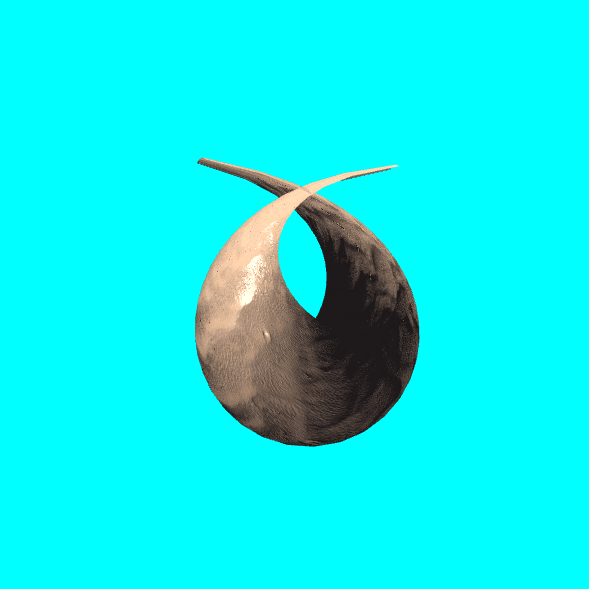

# VGGI – CONTROL TASK (Practical Assignment №3) 
###  **Texture Mapping and Normal Mapping – Sievert’s Surface (Variant 18)**    
**Author:** Andrii Khavkin  
**Group:** TR-52mp  
**Course:** Visualization of Graphical and Geometric Information  

---

This project implements **texture mapping**, **specular mapping**, and **normal mapping** for the analytical **Sievert’s Surface (Variant 18)** using **WebGL 1.0**.  

It extends the shaded model from **PA2**:

- keeps the analytical surface from PA1/PA2,
- keeps the **triangle mesh** with **facet average vertex normals**,  
- adds a **tangent-space TBN basis** and **per-pixel lighting** with normal mapping,  
- uses a **dynamically animated point light** and interactive **U/V segment sliders**. 

According to **Variant 18**, during **Gram–Schmidt orthogonalization** the **normal vector has priority** when constructing the tangent space.
---

## Gallery

---

## Assignment Requirements (CT)

This project implements all main requirements of Practical Assignment №3:

- Use the **analytic surface model from PA2** as a base.  
- Keep **triangle mesh rendering** with facet-average vertex normals.  
- Add **texture mapping** (diffuse texture).  
- Add **specular map** to modulate highlight intensity.  
- Add **normal map** in **tangent space** to create detailed surface relief.  
- Construct the **TBN basis** (tangent, bitangent, normal) per vertex.  
- Use **Gram–Schmidt orthogonalization** with **priority given to the normal** (Variant 18).   
- Implement **per-pixel lighting** in the fragment shader (Phong model).   
- Animate a **point light source** moving along a circular trajectory.   
- Keep **interactive sliders** for **U segments** and **V segments** and rebuild the mesh on change.   
- Use only **WebGL 1.0** and the provided matrix utilities (no external 3D engines).

---

## Sievert Surface – Variant 18

The analytic surface is defined by:

- \( \varphi(u) \)  
- \( a(u, v) \)  
- \( r(u, v) \)  
- \( z(u, v) \)

The project uses these equations exactly as given in the original Sievert’s Surface definition.  

In code, the parametrization is implemented in the `surfaceFunc(u, v)` function, which returns a 3D point \((x, y, z)\) for given parameters \((u, v)\) and applies a global scale to fit the surface into the camera view.   

---

## Project Structure

WebGL/ 
│ 
├── index.html           # HTML page, canvas, UI text, U/V sliders 
├── main.js              # WebGL init, shaders, matrices, light animation, draw loop 
├── model.js             # Sievert’s Surface mesh, normals, tangents, index buffers 
├── shader.gpu           # Vertex + fragment shaders (TBN + normal mapping) 
├── TextureHandler.js    # Helper for loading 2D textures with a blue fallback pixel 
│ 
├── Utils/ 
│   ├── m4.js            # Matrix utilities (MV, MVP, inverse/transpose) 
│   └── trackball-rotator.js # Mouse-based virtual trackball for view rotation 
│ 
├── textures/ 
│   ├── diffuse.jpg      # Diffuse (albedo) sand texture 
│   ├── specular.jpg     # Specular/gloss map 
│   └── normal.jpg       # RGB tangent-space normal map 
│ 
└── screenshots/ 
    ├── final_render_CT.png 
    └── pdf_reference.png 

TextureHandler.js initializes each texture as a 1×1 blue pixel and then asynchronously replaces it with the loaded image once it is available, forcing a redraw.

---

## Implementation Details

### Triangle Mesh Generation
- The parametric domain *(u, v)* is discretized into **U × V** segments.
- For each grid point, surfaceFunc(u, v) evaluates the analytic Sievert’s Surface and writes (𝑥,𝑦,𝑧) into a position buffer.
- Four neighbouring vertices form a quad, which is split into two triangles using an index buffer (gl.ELEMENT_ARRAY_BUFFER).
- Changing U/V segments in the sliders triggers surface.buildMesh() and rebuilds the mesh with new resolution.

### Vertex Normals – Facet Average
For each triangle:

facetNormal = normalize(cross(v1 - v0, v2 - v0))

This normal is added to the normals of all three vertices:

vertexNormal[v0] += facetNormal
vertexNormal[v1] += facetNormal
vertexNormal[v2] += facetNormal

Finally, all vertex normals are normalized.

### Tangent Space and Gram–Schmidt (Normal Priority)

To support normal mapping, a tangent vector is computed for each vertex:

 - For every vertex, a provisional tangent is built as the direction along increasing 𝑢 (difference between neighbouring vertices in the U direction).

 - The corresponding averaged normal 𝑁 is normalized.

 - According to Variant 18, priority is given to the normal in Gram–Schmidt orthogonalization:

const dotNT = dot(N, T);
T = T - dotNT * N;  // project out normal component
T = normalize(T);

 - B (bitangent) is reconstructed in the vertex shader as B = cross(N, T).
 - The TBN matrix:

 #### TBN = [ 𝑇,𝐵,𝑁 ]

is used to transform light and view directions into tangent space.

### Texture Mapping and Normal Mapping

 - Each vertex additionally stores texture coordinates (u, v) in [0,1] × [0,1].
 - In the fragment shader:

vec3 Kd_tex = texture2D(uSamplerDiffuse, vTexCoord).rgb;
vec3 Ks_tex = texture2D(uSamplerSpecular, vTexCoord).rgb;
vec3 nTex   = texture2D(uSamplerNormal,  vTexCoord).xyz * 2.0 - 1.0;

 - The normal map is converted from [0,1] RGB into [−1,1] tangent-space vector and normalized.
 - This perturbed normal is used in the Phong lighting model, resulting in detailed sand-like relief even on a relatively coarse triangle mesh.

### Per-Pixel Lighting (Fragment Shader)

Lighting is computed per fragment (per-pixel) in the fragment shader using the Phong model:

color = 𝐾𝑎 ⋅ ambient + 𝐾𝑑 ⋅ max⁡(0,𝑁 ⋅ 𝐿) + 𝐾𝑠 ⋅ max(0,𝑅 ⋅ 𝑉)shininess

 - Ambient uses diffuse texture color to softly illuminate the whole surface.
 - Diffuse (Lambert) uses the normal-mapped 𝑁 and light direction 𝐿 in tangent space.
 - Specular (Phong) uses the reflection vector 𝑅, view direction 𝑉, and specular map to control highlight intensity.

Light and eye positions are passed in view space (uLightPosition, uEyePosition), transformed to tangent space using TBN in the vertex shader, and interpolated across the triangle.

### Animated Point Light

 - The point light moves on a circular orbit around the surface:

let t = performance.now() * 0.001;
let radius = 8.0;
let lightX = radius * Math.cos(t);
let lightZ = radius * Math.sin(t);
let lightY = 4.0;

 - The moving light highlights the details produced by the normal map and clearly shows the effect of tangent-space perturbations when the model rotates.

### Interactive U/V Sliders

 - HTML <input type="range"> elements control the number of segments along U and V.
 - On input event, the new values are written to surface.uSegments and surface.vSegments, after which surface.buildMesh() is called.
 - The updated mesh is immediately rendered with the same textures and lighting.

---

## Running the Project

Option 1 – VS Code Live Server

Open the folder in VS Code.

Right-click index.html → Open with Live Server.

The page will open in the browser (typically at http://127.0.0.1:5500/...).

Option 2 – http-server
npm install -g http-server
http-server

Then open in your browser:

http://localhost:8080

WebGL content must be served via HTTP; direct file:// access is not allowed due to browser security restrictions.

---

## Video Presentation

The video (1.5–2 minutes) should demonstrate:

analytic Sievert’s Surface (Variant 18),

textured model with normal mapping,

dynamic point light moving around the surface,

effect of U/V resolution sliders,

close-ups showing sand-like relief and specular highlights.

Video link: https://youtu.be/_cTZgXrRGiM

---

## CT(PA3) Checklist

 - [x] Triangle mesh rendering

 - [x] Facet average vertex normals (from PA2)

 - [x] Tangent-space basis (TBN) per vertex

 - [x] Gram–Schmidt with normal priority (Variant 18)

 - [x] Diffuse texture mapping

 - [x] Specular mapping

 - [x] Normal mapping in fragment shader

 - [x] Per-pixel Phong lighting

 - [x] Animated point light source

 - [x] U/V sliders and dynamic mesh rebuild

 - [x] Screenshots prepared

 - [x] Video presentation prepared

 - [x] Git branch for CT(PA3) created

---

## Licensing

Educational project for KPI / VGGI course (2025).