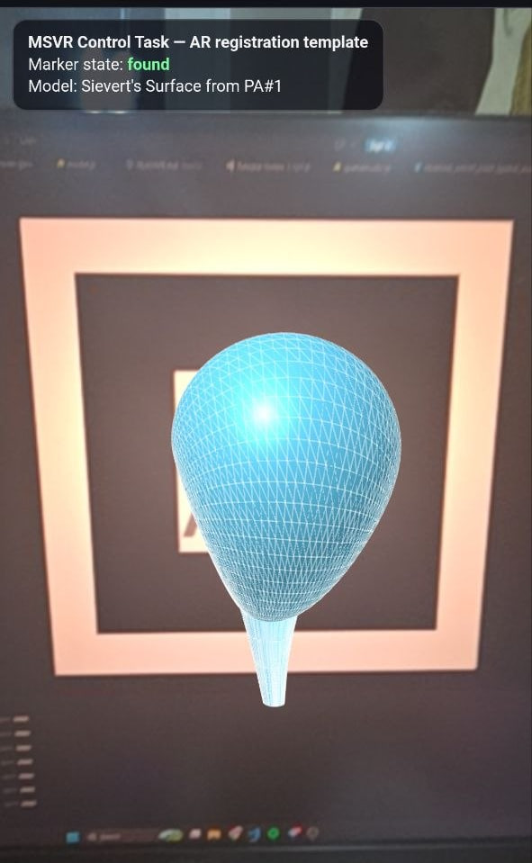

# MSVR — Control Task  
### **AR Registration Template for Sievert's Surface**

**Author:** Andrii Khavkin  
**Group:** TR-52mp  
**Course:** Methods of Synthesis of Virtual Reality  
**Branch:** `ControlTask`

---

## Overview

This project implements the final control task for the **Methods of Synthesis of Virtual Reality** course. The goal of the task is to create an augmented reality registration template and render a virtual model dynamically aligned with a physical marker.

The implementation uses **AR.js** and **A-Frame** to detect a custom registration marker through the smartphone camera. When the marker is found, the application places the same analytical model that was used in Practical Assignment 1 — **Sievert's Surface** — above the marker in real time.

The AR part is implemented as a separate page, so the previous WebGL, stereo rendering, tangible interface, and spatial audio functionality remain unchanged.

---

## Final Result

<div align="center">



</div>

> The screenshot shows the final AR result: the smartphone camera detects the registration marker and renders Sievert's Surface above it. The model remains attached to the marker while the camera position changes.

---

## Assignment Requirements

The control task requires creating a marker-based augmented reality application.

The implemented solution includes:

- custom registration template generated for AR.js;
- marker pattern file connected through `pattern-marker.patt`;
- smartphone camera tracking through AR.js;
- dynamic alignment of the virtual model with the physical marker;
- rendering of the same Sievert's Surface model from PA#1;
- visible wireframe overlay on the surface;
- separate AR page that does not break the previous WebGL pipeline;
- demonstration screenshot and recorded video in the repository.

---

## AR Registration Template

The registration marker consists of two files stored in the `markers` directory:

```text
markers/
├── pattern-marker.patt   # AR.js marker pattern file
└── pattern-marker.png    # Printable marker image
```

The `.patt` file is used by AR.js for tracking. The `.png` image is intended for printing or displaying during testing.

In the final AR page, the marker is connected as a custom pattern:

```html
<a-marker
  id="registrationMarker"
  type="pattern"
  url="./markers/pattern-marker.patt"
  emitevents="true">
```

When the marker is detected, the status label changes from `searching...` to `found`, confirming successful registration.

---

## Rendered Model

The virtual object is **Sievert's Surface**, reused from the first practical assignment. The model is generated procedurally as a parametric surface and converted into a Three.js `BufferGeometry` inside the A-Frame component.

The model includes:

- regular parametric UV sampling;
- indexed triangle mesh;
- computed vertex normals;
- cyan surface material;
- white wireframe overlay;
- small animation around the vertical axis for better visual demonstration.

The AR implementation uses a simplified rendering layer compared with the full WebGL pipeline from previous assignments. This was done intentionally to keep marker tracking stable on a smartphone while preserving the same analytical surface.

---

## Project Structure

```text
WebGL/
│
├── ar.html                 # Final AR page for the control task
├── ar-sievert.js           # A-Frame component that builds Sievert's Surface
├── index.html              # Previous WebGL / spatial audio page
├── main.js                 # Previous WebGL rendering logic
├── model.js                # Original analytical surface mesh generator
├── shader.gpu              # Previous shader sources
├── TextureHandler.js       # Texture loading helper
├── spatialAudio.js         # Spatial audio module from the previous work
├── server.js               # Local Node.js static server
│
├── markers/
│   ├── pattern-marker.patt # Custom AR.js marker pattern
│   └── pattern-marker.png  # Printable marker image
│
├── screenshots/
│   └── CT_AR.jpg           # Final AR result screenshot
│
├── video/
│   └── MSVR_CT.mp4         # Local demonstration video
│
├── textures/               # Textures from previous WebGL work
├── audio/                  # Audio files from previous spatial audio work
└── Utils/                  # Matrix and interaction utilities
```

---

## Running the Project

Install dependencies once:

```bash
npm install ws
```

Run the local server:

```bash
node server.js
```

Open the AR page locally:

```text
http://localhost:8080/ar.html
```

For smartphone testing, expose the local server through an HTTPS tunnel:

```bash
lt --port 8080
```

Then open the generated HTTPS link on the smartphone:

```text
https://your-tunnel-url/ar.html
```

The browser should request camera permission. After permission is granted, point the smartphone camera at the printed or displayed marker.

---

## How It Works

The AR page uses AR.js marker tracking. The smartphone camera stream is processed by the AR.js pipeline. When the custom marker is recognized, AR.js updates the transformation matrix of the marker entity.

The Sievert's Surface entity is placed as a child object of the marker. Because of this, the model automatically follows the marker position and orientation. Moving the camera or the marker demonstrates dynamic registration between the physical template and the virtual model.

The previous WebGL application remains available through `index.html`, while the AR control task is isolated in `ar.html`.

---

## Demonstration Video

A local demonstration video is included in the repository:

```text
video/MSVR_CT.mp4
```

The video demonstrates:

- opening the AR application on a smartphone;
- granting camera permission;
- pointing the camera at the registration marker;
- marker recognition with the `found` status;
- rendering of Sievert's Surface above the marker;
- movement of the camera while the virtual model remains aligned with the marker.

YouTube video link:

```text
https://youtube.com/shorts/xauRAFeF6BE?feature=share
```

---

## Implementation Checklist

- [x] Created a separate AR page for the control task
- [x] Connected AR.js and A-Frame marker tracking
- [x] Generated a custom registration marker
- [x] Added `pattern-marker.patt` to the repository
- [x] Added printable marker image to the repository
- [x] Reused Sievert's Surface from PA#1
- [x] Converted the analytical surface into Three.js geometry
- [x] Added surface material and wireframe overlay
- [x] Rendered the model above the detected marker
- [x] Verified marker recognition on smartphone
- [x] Verified dynamic alignment between marker and virtual object
- [x] Added final AR screenshot
- [x] Added local demonstration video

---

## Notes

During testing, the marker can be displayed on a monitor, but printed markers usually provide more stable tracking. A printed marker reduces glare, pixel artifacts, and screen refresh issues, which improves AR.js recognition quality.

The AR implementation intentionally does not modify the previous spatial audio and WebGL rendering files. This keeps the project modular and allows the earlier assignments to remain accessible.

---

## Licensing

Educational project for KPI / Methods of Synthesis of Virtual Reality course.
